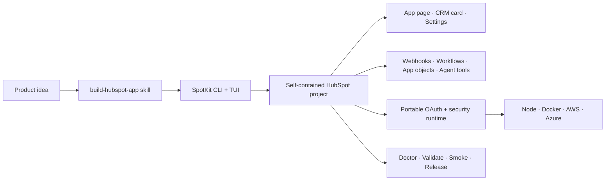

# HubSpotLab

Build, review, and operate serious HubSpot apps from one open-source workspace.

[](https://github.com/mathias7799/HubSpotLab/actions/workflows/ci.yml)
[](LICENSE)
[](package.json)
[](tools/spotkit/README.md)

HubSpotLab turns the lessons hidden inside one-off HubSpot projects into tools
that can be reused. Real applications prove the patterns, SpotKit makes the
repeatable work deterministic, and a five-skill agent suite gives coding agents
HubSpot-specific engineering judgment.

This is not a collection of disconnected demos. It is a practical path from an
app idea to a project that can be diagnosed, upgraded, deployed, and handed to
another maintainer.

## Why HubSpotLab exists

HubSpot apps quickly span UI extensions, CRM modeling, OAuth, associations,
webhooks, workflow actions, hosting, and portal-specific operations. The happy
path is easy to demonstrate; the lifecycle around it is where projects become
fragile.

HubSpotLab keeps those concerns connected:

- **TidsHub and CloseReady prove the architecture** against real product UX,
  associations, approvals, rules, and installation behavior.
- **SpotKit turns proven patterns into safe operations** through a CLI and TUI
  for creation, adoption, diagnostics, upgrades, development, and releases.
- **The portable runtime handles trust boundaries** such as OAuth, HubSpot
  signatures, encrypted tenant storage, refresh races, and cloud adapters.
- **Agent skills teach the full HubSpot lifecycle** while delegating repeatable
  changes and checks to SpotKit instead of asking an AI to improvise them.

## Start here

Explore every app in the workspace from the interactive control center:

```bash
corepack enable
pnpm install
pnpm spotkit ui
```

The control center discovers every HubSpot project and brings diagnostics,
lifecycle upgrades, origin management, release checks, OAuth reconnect, and
deployed smoke testing into one workflow.

Create a new OAuth app, or inspect an existing workspace from scripts and CI:

```bash
pnpm spotkit create handoff-ready \
  --directory projects \
  --name "HandoffReady" \
  --api-origin https://api.handoff-ready.com
pnpm spotkit add webhooks projects/handoff-ready
pnpm spotkit doctor projects/handoff-ready --strict
pnpm spotkit inventory projects
```

## The platform



- **Agent skills decide:** select the right profile, component, persistence,
  entitlement, and verification path.
- **SpotKit executes:** scaffold, extend, inspect, diagnose, develop, migrate,
  document, and release with safe defaults.
- **Projects own products:** apps, services, tests, screenshots, and operational
  documentation stay together.
- **The runtime protects boundaries:** OAuth tokens, signatures, encryption,
  tenant isolation, refresh, and hosting adapters remain outside UI extensions.

## What ships today

| Product                             | What it demonstrates                                                                                                             | Start here                                                |
| ----------------------------------- | -------------------------------------------------------------------------------------------------------------------------------- | --------------------------------------------------------- |
| **TidsHub**                         | Weekly time registration, CRM associations, project/task context, editing, approvals, and operational dashboards                 | [Product guide](projects/tidshub/README.md)               |
| **CloseReady**                      | Pipeline-specific readiness rules, associated-record requirements, guarded deal transitions, configuration, and clear blocker UX | [Product guide](projects/closeready/README.md)            |
| **SpotKit 0.7**                     | HubSpot project generator, feature catalog, diagnostics, lifecycle management, release tooling, and interactive terminal UI      | [Tool guide](tools/spotkit/README.md)                     |
| **SpotKit runtime**                 | Portable OAuth, signature v3, encrypted token/configuration storage, idempotency, and cloud adapters                             | [Package guide](packages/spotkit-runtime/README.md)       |
| **Build HubSpot App skill**         | Agentic planning, implementation, adoption, verification, and release workflow backed by SpotKit                                 | [Skill source](skills/build-hubspot-app/SKILL.md)         |
| **Review HubSpot App skill**        | Read-only correctness, security, platform, CRM, UX, operations, and release-readiness audit                                      | [Skill source](skills/review-hubspot-app/SKILL.md)        |
| **Model HubSpot CRM skill**         | Durable object/property models, directional associations, labels, contextual tasks, scopes, and safe schema evolution            | [Skill source](skills/model-hubspot-crm/SKILL.md)         |
| **Design HubSpot Automation skill** | Reliable webhooks, workflow actions, app events, agent tools, contracts, retries, idempotency, and rate-limit behavior           | [Skill source](skills/design-hubspot-automation/SKILL.md) |
| **Operate HubSpot App skill**       | Installation health, deployment evidence, portal diagnostics, incidents, smoke testing, recovery, and rollback                   | [Skill source](skills/operate-hubspot-app/SKILL.md)       |

## SpotKit at a glance

| Area    | Capabilities                                                                                                                                                  |
| ------- | ------------------------------------------------------------------------------------------------------------------------------------------------------------- |
| Create  | OAuth marketplace and static private profiles; app page, CRM card, settings, portable API, Docker/AWS/Azure targets                                           |
| Extend  | Webhooks, workflow actions, one app object, app-object associations, app events, agent tools, optional app functions, and SCIM                                |
| Develop | Coordinated API/HubSpot development, origin synchronization, Cloudflare/ngrok tunnels, and review-first OAuth reconnect                                       |
| Operate | Interactive TUI, project/workspace inventory, lifecycle manifests, non-destructive upgrade plans, and strict doctor diagnostics                               |
| Release | Secret/origin scanning, official HubSpot validation, confirmation-gated build upload, deployed smoke tests, screenshot galleries, and npm provenance workflow |
| Secure  | OAuth state binding, signature v3, AES-256-GCM tenant isolation, durable Upstash storage, atomic idempotency, and localhost-only unsafe modes                 |

SpotKit enforces at most one app object per project. HubSpot-hosted app functions
remain optional and never become an Enterprise-only requirement for marketplace
apps. Gated HubSpot components still require the relevant HubSpot approval and
account entitlement.

## Build with an AI agent

The repository-owned [`build-hubspot-app`](skills/build-hubspot-app/SKILL.md)
skill turns natural-language product requests into evidence-driven SpotKit work.
It handles requests such as:

- “Design a pure HubSpot app with no backend.”
- “Add signed webhooks and an unpublished workflow action.”
- “Adopt this existing HubSpot project without overwriting product code.”
- “Prepare this app for HubSpot validation and a release candidate.”
- “Model a required Primary company and optional associated task correctly.”

Install the skill into Codex when developing outside this repository:

```bash
mkdir -p "${CODEX_HOME:-$HOME/.codex}/skills"
cp -R skills/build-hubspot-app skills/review-hubspot-app \
  skills/model-hubspot-crm skills/design-hubspot-automation \
  skills/operate-hubspot-app \
  "${CODEX_HOME:-$HOME/.codex}/skills/"
```

Then invoke `$build-hubspot-app` to implement or `$review-hubspot-app` for a
read-only production audit. Use `$model-hubspot-crm` for object, property,
association, project, or task modeling. See the [skills catalog](skills/README.md)
for the agentic-development roadmap. Use `$design-hubspot-automation` for
webhooks, workflow actions, app events, agent tools, and delivery reliability.
Use `$operate-hubspot-app` for installations, deployments, portal failures,
incidents, smoke tests, and rollback planning.

## What comes next

The next milestone is depth, not a larger feature checklist:

1. **Production hardening:** close the evidence-backed security, authorization,
   partial-write, deployment-origin, and authenticated browser-test gaps found
   by reviewing TidsHub and CloseReady.
2. **SpotKit 1.0:** stabilize its project contract, publish the package, exercise
   clean upgrades against adopted projects, and make the TUI the dependable
   control plane for day-to-day HubSpot app work.
3. **Agent workflow proof:** run the five existing skills through complete build,
   review, modeling, automation, and incident scenarios; improve them from real
   failures before introducing additional skills.
4. **Ecosystem growth:** add integrations, recipes, or new skills only when a
   repeated project need demonstrates a reusable boundary.

See the [repository roadmap](docs/roadmap.md) for exit criteria and the
[SpotKit roadmap](tools/spotkit/docs/roadmap.md) for tool-specific milestones.

## Choose the right architecture

| Need                                                                          | Recommended shape                                                                      |
| ----------------------------------------------------------------------------- | -------------------------------------------------------------------------------------- |
| HubSpot UI and supported client APIs cover every operation                    | Keep it HubSpot-only; do not invent a backend                                          |
| OAuth marketplace distribution, durable tokens, webhooks, or external actions | Use SpotKit's marketplace profile and portable API                                     |
| HubSpot-hosted functions or SCIM                                              | Use a separate `private-static` project                                                |
| Portal-owned application data                                                 | Prefer zero objects; use the single app-object recipe only when justified and entitled |

Generated marketplace services are web-standard and can run on generic Node,
Docker, AWS Lambda, or Azure Functions. Serverless is a hosting option, not a
product requirement.

## Repository map

| Path                              | Purpose                                             |
| --------------------------------- | --------------------------------------------------- |
| [`projects/`](projects/README.md) | Self-contained products and deployable surfaces     |
| [`packages/`](packages/README.md) | Shared runtime libraries and deliberate interfaces  |
| [`tools/`](tools/README.md)       | SpotKit and future developer tooling                |
| [`skills/`](skills/README.md)     | Reusable agent workflows and domain knowledge       |
| [`docs/`](docs/README.md)         | Architecture, decisions, and repository conventions |
| [`examples/`](examples/README.md) | Small integration examples                          |

## Validate the repository

Use Node.js 24 and pnpm 11.6 or newer:

```bash
pnpm format:check
pnpm skills:validate
pnpm lint
pnpm typecheck
pnpm test
pnpm --dir tools/spotkit build
```

Validate one app or the whole HubSpot workspace:

```bash
pnpm spotkit doctor projects/tidshub --strict
pnpm spotkit inventory projects
```

CI also builds and installs SpotKit from its packed npm tarball, generates a
standalone app, adds features, runs its tests/typechecks/build, and checks its
lifecycle state outside this repository.

## Maturity and release status

HubSpotLab is pre-1.0. TidsHub and CloseReady are functional reference products,
not claims of production certification. SpotKit 0.7 passes its local,
clean-room-package, and official HubSpot validation gates. Current production
reviews intentionally keep apps marked non-release-ready until stable public
origins, authorization decisions, and authenticated portal verification are in
place.

The public npm release workflow is prepared with provenance and tag/version
guards, but `@hubspotlab/spotkit` has not yet been published. No README command
pretends otherwise.

Read [CONTRIBUTING.md](CONTRIBUTING.md) before changing repository structure and
[SECURITY.md](SECURITY.md) for private vulnerability reporting. HubSpotLab is
available under the [MIT license](LICENSE).
