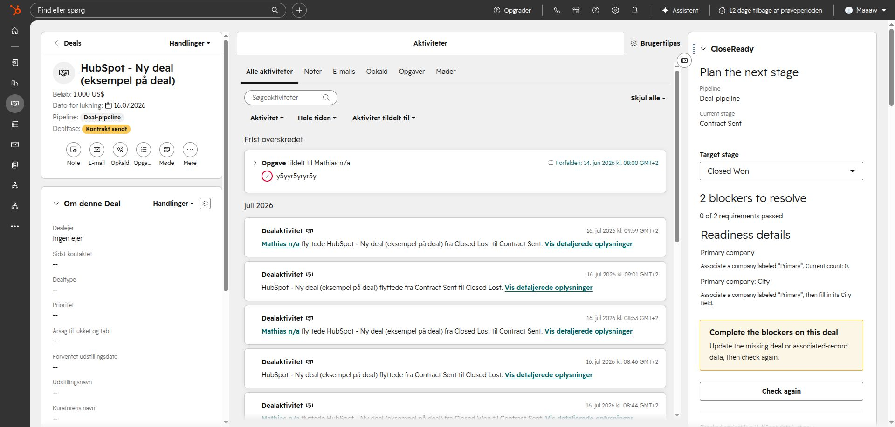

# CloseReady

CloseReady is a HubSpot-native deal readiness and pipeline-governance app. It
lets revenue teams define different completion rules for every pipeline and
stage, then explains exactly what prevents a deal from progressing or closing.

## Product surfaces

- **Deal card:** target-stage selection, live checks, concise blockers and
  warnings, and a guarded move when requirements pass.
- **App page:** installation health, active-rule totals, and target-stage
  coverage for each pipeline.
- **Configuration:** create, edit, pause, enable, and safely delete transition
  requirements.
- **Guarded transition:** validates every CloseReady blocker before moving a
  deal to its target stage.

HubSpot-native required stage properties provide absolute blocking for deal
properties. CloseReady evaluates richer conditions such as labeled associations,
required fields on associated contacts or companies, line items, quotes, and
open tasks. Rules can apply to one exact source-to-target transition or to every
move into a target stage. See the [product plan](docs/product-plan.md) and
[enforcement model](docs/enforcement.md).

## Current foundation

CloseReady contains a deterministic rule engine, portable HubSpot API client,
web-standard HTTP contract, Node runtime adapter, encrypted token and rule
stores, and native HubSpot UI extensions. The HTTP handler is intentionally
hosting-neutral; additional cloud adapters can wrap it without changing the
rule engine.

The HubSpot experience is split into three focused surfaces:

- the deal sidebar card checks a selected transition and performs the guarded
  move only when every blocker passes;
- the app overview shows target-stage coverage, blockers, warnings, and rule
  types per pipeline;
- the app's `/settings` route owns transition-rule configuration;
- the native Connected Apps settings page reports installation health, OAuth
  access, portal inventory, and the active storage mode.


The overview confirms portal access, storage readiness, active rules, and stage
coverage before administrators begin relying on the guarded workflow.


Rules can target any source stage or one exact transition. Administrators can
require deal properties, labeled contact or company associations, fields on
associated records, line items, approved quotes, or open tasks. Existing rules
can be edited, paused, re-enabled, or deleted with confirmation.



On a deal, the rep selects a target stage and checks live readiness. CloseReady
lists every pass, warning, and blocker. The move action only appears when all
blocking requirements pass; an unconfigured transition cannot be moved through
the card.


See the [visual product tour](docs/product-tour.md) for the complete workflow
and supported rule types.

## Prerequisites

- Node.js 24 or newer and pnpm 11;
- a HubSpot developer project with the checked-in app components uploaded;
- an HTTPS API origin reachable by HubSpot;
- OAuth client credentials and a long random token-encryption key;
- Upstash REST Redis for durable production token storage and portable rule
  storage.

Copy `services/api/.env.example`, configure the values, run the API with
`pnpm --filter @hubspotlab/closeready-api dev`, and open `/oauth/install` on the
public API origin to connect a portal. Local health-check development is
available with `pnpm --filter @hubspotlab/closeready-api dev:local`.

## Storage that fits the portal

CloseReady prefers exactly one custom object named `closeready_rule`. The
backend reuses it on every health check and attempts to create it when the
portal and installation token permit schema writes. No second custom object is
ever created.

HubSpot custom objects require an Enterprise entitlement. On Standard portals,
or whenever HubSpot denies schema administration, CloseReady automatically uses
the portable backend's AES-256-GCM encrypted Upstash store. Rule authoring,
evaluation, and guarded transitions behave the same in both modes. Production
deployments already require this durable store for OAuth tokens, so the fallback
does not introduce another service.

An eligible Enterprise administrator can perform an optional one-time native
object bootstrap from the repository root:

```bash
pnpm exec hs account auth
pnpm exec hs custom-object create-schema \
  --account <account-name-or-id> \
  --path projects/closeready/services/api/schema/closeready-rule.schema.json
```

If HubSpot enables the CLI's custom-object permission, CloseReady will discover
the schema automatically. Native mode also requires adding
`crm.schemas.custom.read`, `crm.objects.custom.read`, and
`crm.objects.custom.write` to `HUBSPOT_SCOPES`; these are optional app scopes so
they do not block installation on Standard portals. Otherwise leave
`RULE_STORAGE=auto`; setup remains ready and selects the encrypted portable
store. Operators can force a mode with `RULE_STORAGE=hubspot` or
`RULE_STORAGE=external`.

When a portal allows custom objects in HubSpot's Data Model UI but does not
grant schema-write API access, create one object named `CloseReady rule` with
internal name `closeready_rule` and primary property `rule_name`. CloseReady
detects this minimal administrator-created object and stores each validated rule
as a compact JSON record in that primary property; no additional custom
properties or second object are required.

After the first deployment, add the **CloseReady** card to the standard deal
record layout: **Settings > Objects > Deals > Record customization > Standard
view > Add card > Card library > CloseReady**. Save the layout once; every deal
then gets the guarded transition flow.

```bash
pnpm --dir projects/closeready test
pnpm --dir projects/closeready typecheck
pnpm spotkit doctor projects/closeready
```

The placeholder `closeready.example.com` origin in the HubSpot app metadata and
page client must be replaced with the deployed API origin before upload. Until
then, SpotKit reports the expected placeholder warning and strict release checks
remain blocked.
