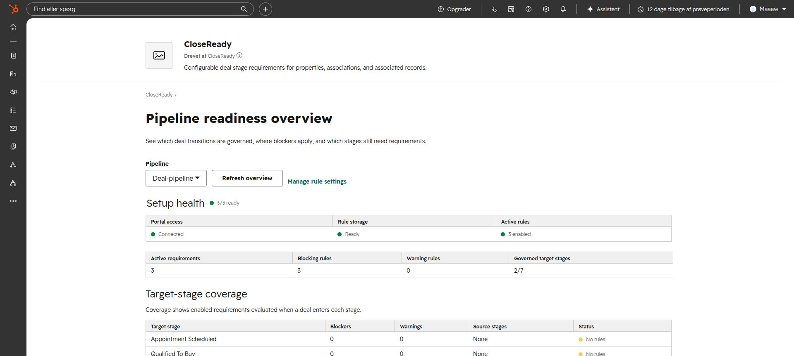
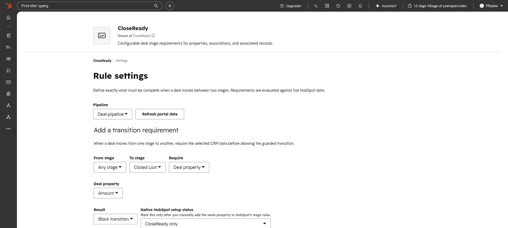
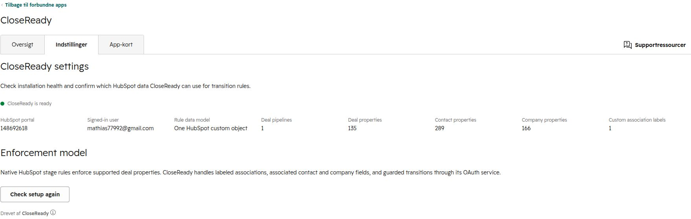

# CloseReady

CloseReady is a HubSpot-native deal readiness and pipeline-governance app. It
lets revenue teams define different completion rules for every pipeline and
stage, then explains exactly what prevents a deal from progressing or closing.

## Product surfaces

- **Deal card:** readiness score, blockers, warnings, and direct remediation.
- **App page:** pipeline health, blocked deals, and readiness by owner/stage.
- **Configuration:** per-pipeline and per-stage required data points.
- **Guarded transition:** validates every CloseReady blocker before moving a
  deal to its target stage.

HubSpot-native required stage properties provide absolute blocking for deal
properties. CloseReady evaluates richer conditions such as labeled associations,
required fields on associated contacts or companies, line items, quotes, and
open tasks. Rules can apply to one exact source-to-target transition or to every
move into a target stage. See the [product plan](docs/product-plan.md) and
[enforcement model](docs/enforcement.md).

## Current foundation

CloseReady now contains the deterministic engine, a portable HubSpot API client,
the web-standard HTTP contract, and the first native HubSpot configuration page.
The runtime adapters and OAuth token store are intentionally separate from the
business logic so the same service can run on Node, Lambda, Azure Functions, or
HubSpot serverless when available.

The HubSpot experience is split into three focused surfaces:

- the app overview shows target-stage coverage, blockers, warnings, and rule
  types per pipeline;
- the app's `/settings` route owns transition-rule configuration;
- the native Connected Apps settings page reports installation health, OAuth
  access, portal inventory, and custom-object status.







## One-object setup

CloseReady stores every rule in exactly one custom object named
`closeready_rule`. The backend reuses that object on every health check and will
attempt to create it when the installation token permits schema writes. The
initial schema contains the complete rule property set.

HubSpot does not currently grant custom-schema write access to this marketplace
OAuth app. A portal administrator must therefore perform this one-time bootstrap
from the repository root:

```bash
pnpm exec hs account auth
pnpm exec hs custom-object create-schema \
  --account <account-name-or-id> \
  --path projects/closeready/services/api/schema/closeready-rule.schema.json
```

The first command requires deactivating and regenerating the CLI personal access
key with the requested schema scopes. After the schema is created, reinstall the
unpublished app with the test OAuth client from HubSpot's Distribution tab and
use **Check storage again** in the native settings page. No further administrator
bootstrap is required for normal use.

```bash
pnpm --filter @hubspotlab/closeready-core test
pnpm --filter @hubspotlab/closeready-core typecheck
pnpm --filter @hubspotlab/closeready-api test
pnpm --filter @hubspotlab/closeready-api typecheck
pnpm --dir projects/closeready/apps/hubspot/src/app/pages typecheck
```

The placeholder `closeready.example.com` origin in the HubSpot app metadata and
page client must be replaced with the deployed API origin before upload.
