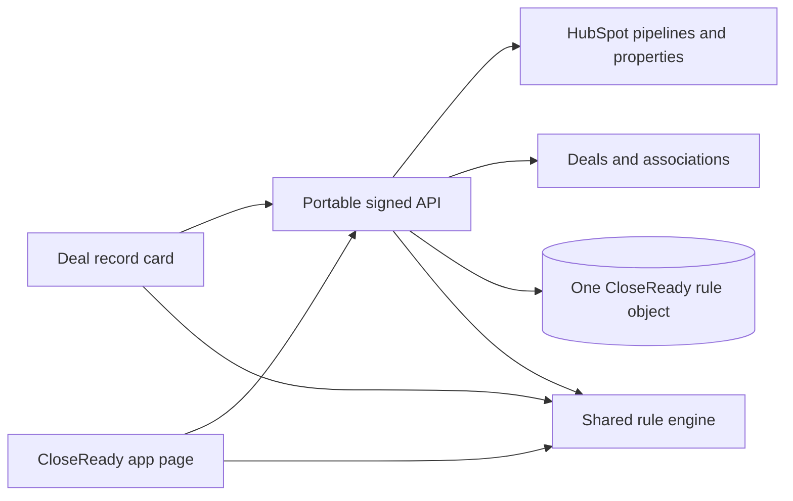

# CloseReady architecture

## One-object persistence

CloseReady stores one record per configured rule in the `closeready_rule`
custom object. Pipeline and stage IDs partition the records. The app does not
store readiness snapshots; it evaluates current HubSpot data on demand.

This keeps configuration auditable without introducing an external application
database or a second custom object. OAuth installations remain encrypted in the
portable service's token store because credentials must never be written to CRM.

## API contract

| Method   | Route                        | Purpose                                   |
| -------- | ---------------------------- | ----------------------------------------- |
| `POST`   | `/api/provision`             | Reuse or create the one rule object       |
| `GET`    | `/api/catalog`               | Pipelines, CRM properties, association labels |
| `GET`    | `/api/rules?pipelineId=…`    | List pipeline rules                       |
| `POST`   | `/api/rules`                 | Create a validated rule                   |
| `PATCH`  | `/api/rules/:id`             | Update a validated rule                   |
| `DELETE` | `/api/rules/:id`             | Archive a rule                            |
| `POST`   | `/api/deals/:id/evaluate`    | Evaluate against a target stage           |
| `POST`   | `/api/deals/:id/transition`  | Guard and perform an allowed transition   |
| `GET`    | `/api/overview?pipelineId=…` | Pipeline readiness dashboard              |

Every `/api/*` request uses HubSpot signature v3. The service rechecks rules
and current deal facts during a guarded transition; it never trusts readiness
results supplied by the UI.

## Snapshot collection

The API reads only the properties referenced by applicable rules and builds a
structured snapshot consumed by the shared engine:

- arbitrary deal properties;
- associated contacts and companies, including their deal-association labels;
- arbitrary properties on those associated records;
- line-item, approved-quote, and open-task counts.

Rules select this data explicitly. Associated-record property rules may require
at least one (`any`) or every (`all`) matching record, optionally filtered to a
label such as `Decision maker`.
