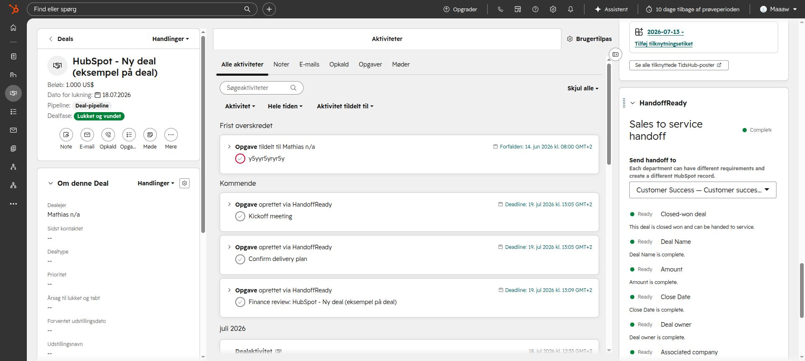
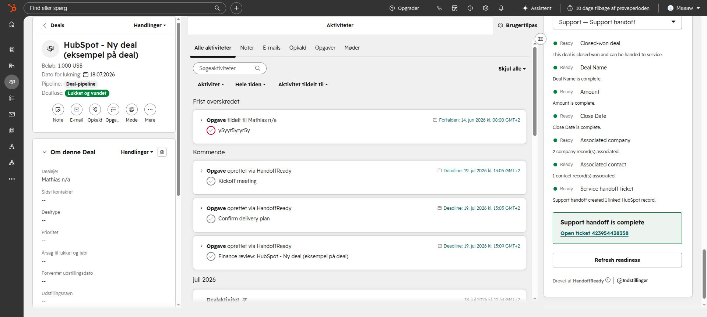
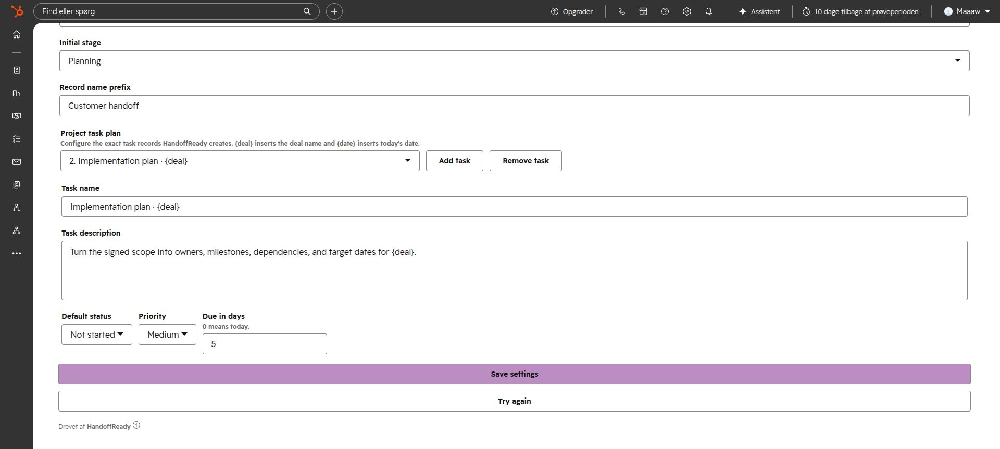
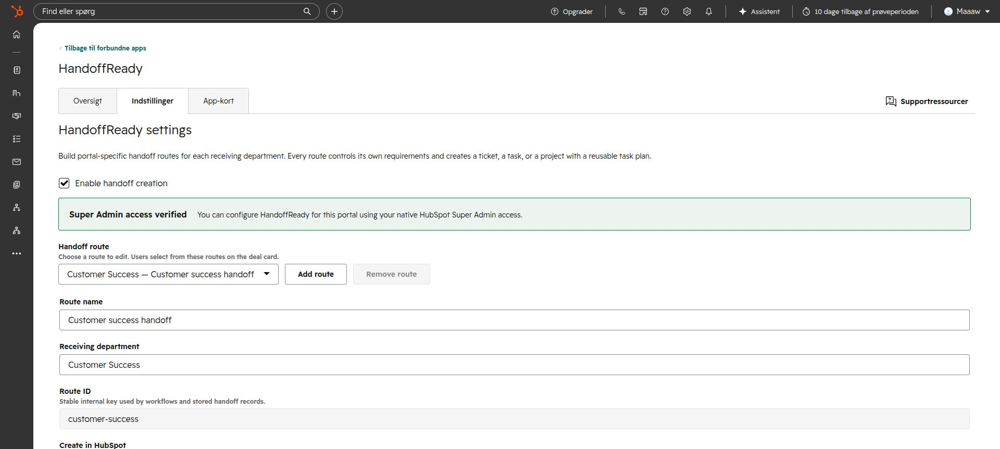
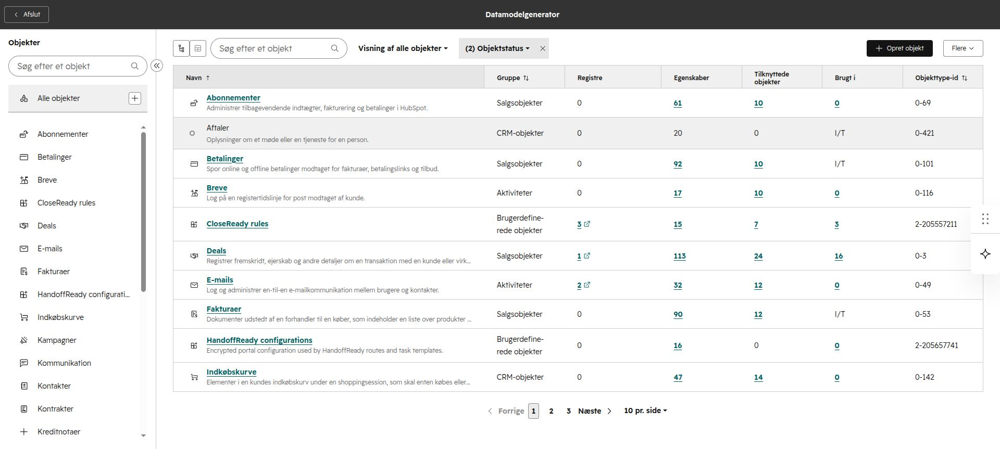

# HandoffReady

HandoffReady turns a closed-won deal into a complete, visible handoff to any
department. HubSpot Super Admins configure named portal routes with independent
deal requirements and choose whether each route creates a ticket, a standalone
task, or a project with a reusable task plan.

Generated with
[SpotKit](https://github.com/mathias7799/HubSpotLab/tree/main/tools/spotkit).
The project was generated and extended through SpotKit as an end-to-end proof
of HubSpotLab's agent workflow. The `.spotkit.json` file records lifecycle schema and generator versions only;
HubSpot metadata remains authoritative for the app profile and features.

Run `pnpm spotkit ui <this-project>` for the interactive overview, diagnostics,
upgrade plan, origin, release, OAuth, and smoke-test workflows.

## Structure

- `apps/hubspot`: HubSpot app metadata, app page, CRM card, and settings.
- `packages/spotkit-runtime`: tested OAuth, request-signing, encryption, and token-storage boundaries.
- `services/api`: portable web-standard API with a local Node adapter.
- `docs`: product-owned documentation and decisions.

## Product workflow

1. A HubSpot Super Admin adds up to 12 handoff routes, names the receiving
   department, selects Ticket, Task, or Project + tasks, and configures that
   route's fields, associations, destination, naming, and task template.
2. The deal sidebar card lets the user choose the receiving route, evaluates
   its live CRM requirements, and explains every missing prerequisite.
3. When ready, HandoffReady creates and links the configured HubSpot records.
   Each task template controls its name, description, default status, priority,
   and due-date offset, with `{deal}` and `{date}` placeholders.
   Route/deal output identity is stored in encrypted portal configuration;
   ticket routes also repair missing tracking from their route-specific subject
   marker. Partial project/task failures trigger compensating cleanup.
4. The app page summarizes the ten most recently updated closed-won deals for
   the portal's primary route as complete, ready to create, or needing attention.
5. An unpublished deal workflow action can evaluate the same rules or create
   the ticket. Webhook subscriptions for deal creation/stage change remain
   inactive until a deployed retry test is complete.

HandoffReady supports two encrypted configuration adapters. Upstash uses zero
custom objects. `HANDOFFREADY_CONFIGURATION_STORAGE=hubspot-object` uses exactly
one `handoffready_configuration` object and stores encrypted route and
output-identity records inside the portal. Marketplace OAuth can use its records
but may require a Super Admin to create the schema once; the adapter discovers
the actual unique primary property automatically. OAuth installations always
remain in the token store because a portal token is required before its object
can be read. Deals, companies, contacts, tickets, tasks, and projects remain
native HubSpot records.

Production writes fail closed unless the signed HubSpot user is authorized.
Native HubSpot Super Admin status grants portal configuration and handoff
creation; `HANDOFFREADY_AUTHORIZATION_POLICY` remains available for explicit
operators and non-admin creators. Super Admin status is verified server-side
with the signed user ID and HubSpot's settings API. Readiness views remain
available to signed users.

```dotenv
HANDOFFREADY_AUTHORIZATION_POLICY={"148692618":{"administrators":["12345"],"ticketCreators":["67890"]}}
```

See the [workflow proof](docs/workflow-proof.md) for the architecture decision,
commands, verified behavior, SpotKit feedback, and remaining deployment evidence.
See the [production review](docs/production-review.md) for resolved findings,
release blockers, and residual risks.

## Verified HubSpot UI











## Start locally

```bash
pnpm --dir services/api dev:local
curl http://localhost:8788/health
```

The local-only command uses disposable credentials and memory storage. Before a
real HubSpot development session, copy `services/api/.env.example` to the
ignored `services/api/.env` and add real OAuth credentials.

Open `http://localhost:8788/oauth/install` to start OAuth. Local development
uses an in-memory token store. Production refuses to start without paired
Upstash credentials and encrypts every stored installation using AES-256-GCM.
Every UI request is verified with HubSpot signature v3. The app page, deal card,
settings page, webhook receiver, and workflow action share the portable OAuth
runtime and portal-isolated configuration store.

The generated OAuth callback and fetch origin use `https://handoffready.example.com`.
Replace placeholder origins before uploading the HubSpot project.

## Validate

```bash
pnpm test
pnpm typecheck
pnpm spotkit doctor projects/handoffready
```

Before release, replace every placeholder origin and run the strict release
gate. Upload requires explicit confirmation and creates a HubSpot build without
deploying it:

```bash
pnpm spotkit release-check <this-project> --hubspot
pnpm spotkit upload <this-project> --confirm --message "Release candidate"
pnpm spotkit smoke https://handoffready.example.com
```

Run `smoke` after deploying the API and HubSpot build. Complete the authenticated
test-portal recipe in SpotKit's
[smoke-testing guide](https://github.com/mathias7799/HubSpotLab/blob/main/tools/spotkit/docs/smoke-testing.md)
before production promotion.

Capture reviewed test-portal screenshots as PNG files and refresh the product
gallery with `pnpm spotkit docs-refresh <this-project> --screenshot
"App overview=./captures/overview.png" --confirm`. The command strips common
metadata and writes stable assets under `docs/screenshots`.

## Build and host

```bash
pnpm build
docker build -t handoffready .
```

The build emits generic Node, AWS Lambda, and Azure Functions entry points. See
[hosting](docs/hosting.md) for provider commands and production variables.

See [storage](docs/storage.md) to choose between the default zero-object model
and the encrypted, optional one-custom-object configuration recipe.

## Additional HubSpot features

Webhooks and the workflow action are already installed. From HubSpotLab, run
`pnpm spotkit features` to inspect other recipes. Do not add an app object unless
a future requirement cannot be represented by encrypted configuration or
existing CRM records.

This is an OAuth marketplace profile. App functions and SCIM belong in a
separate project created with `--profile private-static`; SpotKit prevents them
from being added here.

For a real HubSpot development session, run `spotkit sync-origin` to update all
callback, UI, webhook, and action URLs together, then use `spotkit dev`. If
`cloudflared` or `ngrok` is installed, `spotkit tunnel` discovers and syncs the
temporary URL automatically. See the SpotKit
[local-development guide](https://github.com/mathias7799/HubSpotLab/blob/main/tools/spotkit/docs/local-development.md).
