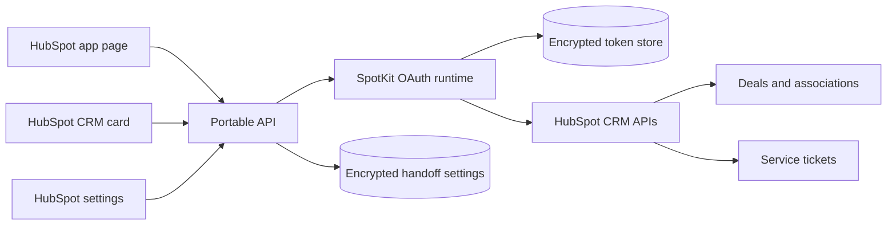

# HandoffReady architecture

HubSpot renders the product UI. The portable API owns secrets, OAuth tokens,
request verification, and operations unavailable to UI extensions. Keep domain
logic independent from the Node adapter so other HTTP runtimes can wrap it.

HandoffReady intentionally uses no custom object. Readiness is derived from live
deal properties and associations. Completion is represented by an associated
HubSpot ticket carrying a stable HandoffReady subject marker; unrelated tickets
are ignored. Ticket creation rechecks the closed-won state, shares an atomic
portal/deal claim across the card and workflow, and treats creation plus
association as one logical operation. A failed association triggers
compensating ticket deletion.
