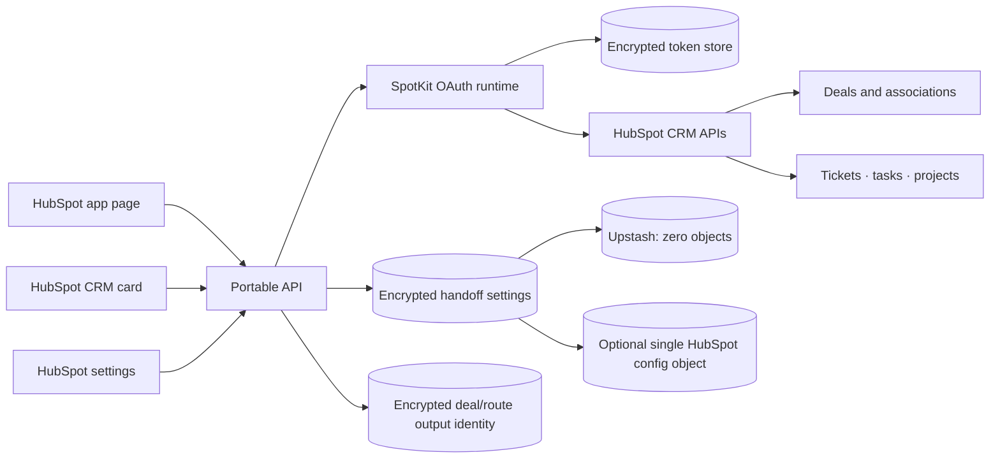

# HandoffReady architecture

HubSpot renders the product UI. The portable API owns secrets, OAuth tokens,
request verification, and operations unavailable to UI extensions. Keep domain
logic independent from the Node adapter so other HTTP runtimes can wrap it.

HandoffReady can use zero custom objects with Upstash or exactly one encrypted
HubSpot configuration object. Portal settings contain up to 12 independently
configurable department routes. Each route owns
its required deal properties, company/contact requirements, output type,
pipeline/stage, record prefix, output owner, and optional project task plan.

Task templates are structured records containing a stable ID, name,
description, activity type, default status, priority, due-date offset, reminder
timing, and person/queue assignment. Names and descriptions support `{deal}`
and `{date}` placeholders.

Readiness is derived from live deal properties and associations. Completion is
represented by the route's tracked HubSpot output IDs. Ticket routes also use a
route-specific subject marker as a migration/repair fallback. Creation rechecks
closed-won state, shares an atomic portal/deal/route claim, and applies
compensating deletion when an association or a later project task fails.

The API verifies native Super Admin status from HubSpot's user-provisioning API
using the signed acting user ID. Deployment policy allowlists remain a fail-safe
for delegated settings administrators and handoff creators.
