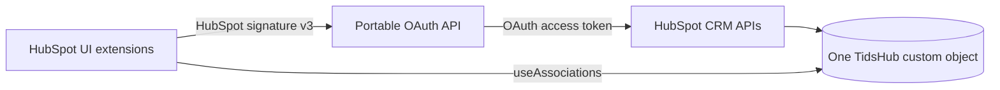

# TidsHub architecture

TidsHub is a HubSpot-native time registration app with one deliberately small
external boundary. HubSpot renders every product surface. The portable OAuth
API handles only capabilities that are unreliable or unavailable from a UI
extension: OAuth token custody, schema provisioning, custom-object writes, and
CRM associations.

## Components

| Component        | Runtime     | Responsibility                                       |
| ---------------- | ----------- | ---------------------------------------------------- |
| App page         | HubSpot     | Week overview, day drill-down, entry CRUD, approvals |
| CRM sidebar card | HubSpot     | Quick entry and association to the current record    |
| Settings page    | HubSpot     | Installation health and idempotent provisioning      |
| OAuth API        | User hosted | Tokens, signatures, schema, records, associations    |
| Token store      | Upstash     | Encrypted, durable installation records              |

The API core uses standard web `Request` and `Response` objects. Thin adapters
translate Node HTTP, AWS Lambda, Azure Functions, or optional HubSpot serverless
events into that contract.

## One-object data model

The schema is named `tidshub_record` for new installations. Provisioning also
recognizes the earlier `tidshub_poster` schema and reuses it. This prevents an
upgrade from creating a second custom object.

The `record_kind` property differentiates records:

- `time_entry`: a user's dated duration, category, description, and billing
  state, including optional CRM association metadata;
- `week`: submission, approval officer, approval state, and weekly totals;
- `norm`: work schedules and the user's selected approval officer.

Time entries can be associated with HubSpot projects (`0-970`), contacts,
companies, deals, and tickets. They can also carry a second, independent
association to a HubSpot task. This supports combinations such as project +
task, deal + task, or contact + task without another custom object. The
registration form searches automatically after two characters and offers
direct result selection. The daily drill-down links each association directly
to its HubSpot record. The API uses a dedicated user-defined association label
for each object pair instead of reusing an arbitrary HubSpot system label.

## Approval workflow

Each user can select another HubSpot user as their approval officer. Submitting
a week creates or updates a `week` record with a snapshot of the registered
minutes and locks further entry creation for that week. Only the assigned
approval officer can approve it. Authorization is checked in the backend, not
only hidden in the interface.

Editing and deleting are available from each day's drill-down while a week is
still a draft. The backend verifies ownership and the week state for both
operations, so submitted and approved weeks cannot be changed through a direct
API request.

## Request trust boundary

Every `/api/*` request must contain HubSpot signature v3 and a timestamp no
older than five minutes. The API reconstructs the public request URL, validates
the HMAC with the OAuth client secret, resolves the portal installation, and
then calls HubSpot with its OAuth access token.

Unsigned requests and the in-memory token store are allowed only for explicit
localhost development. Production startup fails unless durable token storage
is configured.

## Deployment checklist

1. Deploy `projects/tidshub/services/api` with the required environment variables.
2. Replace the development API origin in the app manifest and extension
   constants.
3. Add the exact OAuth callback URL and permitted fetch origin.
4. Run `pnpm tidshub:validate` and `pnpm tidshub:upload`.
5. Install the OAuth app in a HubSpot test portal.
6. Open settings and confirm `TidsHub er klar`.
7. Test the app page and each enabled CRM record type.
